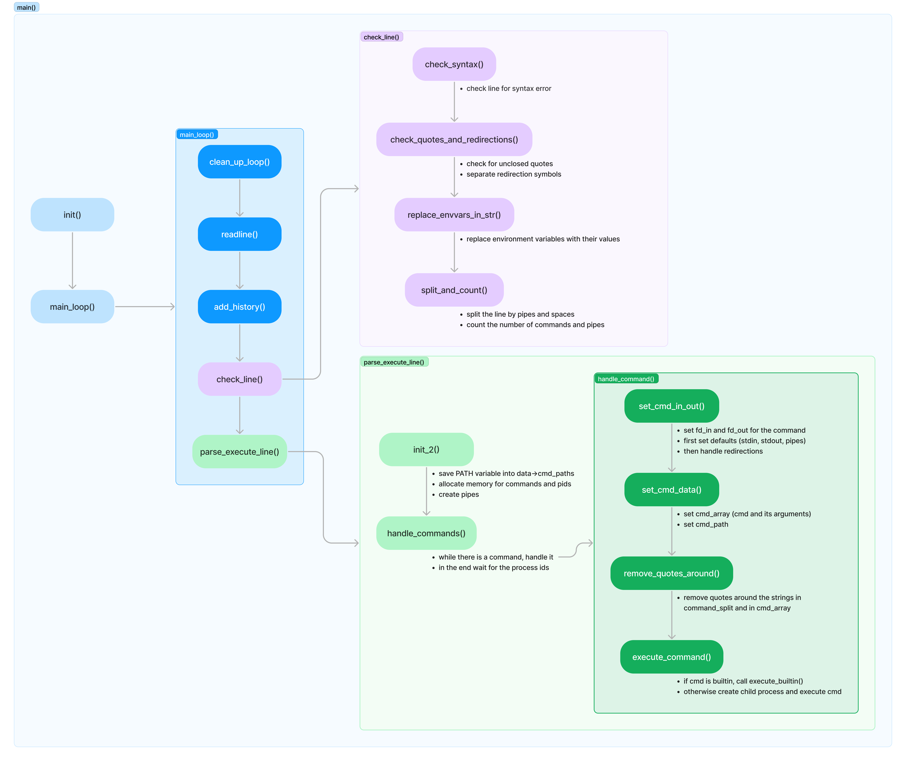

<h1 align="center">42_minishell</h1>

<p align="center">
  <a href="#about">About</a> &#xa0; | &#xa0;
  <a href="#features">Features</a> &#xa0; | &#xa0;
  <a href="#usage">Usage</a> &#xa0; | &#xa0;
  <a href="#simplified-code-logic">Code logic</a> &#xa0; | &#xa0;
  <a href="#used-functions">Used functions</a> &#xa0; | &#xa0;
  <a href="#resources">Resources</a> &#xa0; | &#xa0;
  <a href="#test-results">Test results</a> &#xa0;
</p>

<br>

## About

Minishell is a simple shell implementation written in C that provides basic shell functionalities. This shell aims to mimic some of the functionalities of a standard Unix shell like Bash.

## Features

- Display a prompt when waiting for a new command.
- Maintain a working history of previously executed commands.
- Search and launch the right executable based on the PATH variable or using a relative or absolute path.
- Not interpret unclosed quotes or special characters such as \ (backslash) or ; (semicolon).
- Handle ’ (single quote) which should prevent the shell from interpreting the metacharacters in the quoted sequence.
- Handle " (double quote) which should prevent the shell from interpreting the metacharacters in the quoted sequence except for $ (dollar sign).
- Implement redirections:
  - '<' should redirect input.
  - '>' should redirect output.
  - '<<' should be given a delimiter, then read the input until a line containing the delimiter is seen.
  - '>>' should redirect output in append mode.
- Implement pipes (| character). The output of each command in the pipeline is connected to the input of the next command via a pipe.
- Handle environment variables ($ followed by a sequence of characters) which should expand to their values.
- Handle $? which should expand to the exit status of the most recently executed foreground pipeline.
- Handle ctrl-C, ctrl-D and ctrl-\ which should behave like in bash.
- Implement the following builtins:
  - echo with option -n
  - cd with only a relative or absolute path
  - pwd with no options
  - export with no options
  - unset with no options
  - env with no options or arguments
  - exit with no options

## Usage

```shell
make && ./minishell
```

## Simplified code logic



## Used functions

The following functions were used in this project:

| **Function**    | **Man**        | **Short Description**                                                  |
| --------------- | -------------- | ---------------------------------------------------------------------- |
| readline        | man 3 readline | Reads a line from the terminal                                         |
| rl_on_new_line  | man 3 readline | Tells the GNU Readline library to mark the line as newline             |
| rl_replace_line | man 3 readline | Replaces the contents of the readline buffer                           |
| rl_redisplay    | man 3 readline | Forces a complete redisplay of the readline line buffer                |
| add_history     | man 3 readline | Adds a line to the history list maintained by the GNU Readline library |
| printf          | man 3 printf   | Prints formatted output to stdout                                      |
| malloc          | man 3 malloc   | Allocates a block of memory dynamically                                |
| free            | man 3 free     | Deallocates a block of memory                                          |
| write           | man 2 write    | Writes data to a file descriptor                                       |
| access          | man 2 access   | Checks the accessibility of a file or directory                        |
| open            | man 2 open     | Opens a file or device and returns a file descriptor                   |
| read            | man 2 read     | Reads data from a file descriptor                                      |
| close           | man 2 close    | Closes a file descriptor                                               |
| fork            | man 2 fork     | Creates a new process                                                  |
| wait            | man 2 wait     | Waits for a child process to terminate                                 |
| waitpid         | man 2 waitpid  | Waits for a specific child process to terminate                        |
| signal          | man 7 signal   | Sets a signal handler for a specific signal                            |
| kill            | man 2 kill     | Sends a signal to a process or a group of processes                    |
| exit            | man 3 exit     | Terminates the calling process                                         |
| getcwd          | man 3 getcwd   | Gets the current working directory                                     |
| chdir           | man 2 chdir    | Changes the current working directory                                  |
| stat            | man 2 stat     | Gets file status information                                           |
| unlink          | man 2 unlink   | Deletes a name from the filesystem                                     |
| execve          | man 2 execve   | Executes a program                                                     |
| dup             | man 2 dup      | Duplicates a file descriptor                                           |
| dup2            | man 2 dup2     | Duplicates a file descriptor to a specified new descriptor             |
| pipe            | man 2 pipe     | Creates a pipe, a unidirectional communication channel                 |
| strerror        | man 3 strerror | Returns a string describing the error code passed as argument          |
| isatty          | man 3 isatty   | Tests whether a file descriptor refers to a terminal                   |
| ioctl           | man 2 ioctl    | Performs device-specific operations on a file descriptor               |

Additionally, the following libraries were allowed:

- `libft`

## Resources

Some great resources to make the project easier:

- [Write your own shell](https://youtube.com/playlist?list=PLxIRFba3rzLzxxZMMbrm_-mkI7mV9G0pj&si=cmYw8hbQ3yzjXxvI)
- [Unix processes in C](https://youtube.com/playlist?list=PLfqABt5AS4FkW5mOn2Tn9ZZLLDwA3kZUY&si=Gb277hWIOIhzdNw9)
- [Git & GitHub](https://youtube.com/playlist?list=PL4cUxeGkcC9goXbgTDQ0n_4TBzOO0ocPR&si=Uq1ucOr4MHXsbRTQ)
- [42 minishell](https://youtube.com/playlist?list=PLGU1kcPKHMKj5yA0RPb5AK4QAhexmQwrW&si=qUeTIHAtYtlATnUM)
- [Other minishell resources](https://github.com/pasqualerossi/Minishell_Resources?tab=readme-ov-file)
- Writing a Unix Shell: [Part 1](https://indradhanush.github.io/blog/writing-a-unix-shell-part-1/) | [Part 2](https://indradhanush.github.io/blog/writing-a-unix-shell-part-2/) | [Part 3](https://indradhanush.github.io/blog/writing-a-unix-shell-part-3/)

## Test results

Test results with [this](https://github.com/zstenger93/42_minishell_tester) tester:


<br>

<div align="center">
  Made by <a href="https://github.com/Szabold1" target="_blank">Boldi</a> and <a href="https://github.com/SamuelLeanderEckhard" target="_blank">Samuel</a>
</div>
